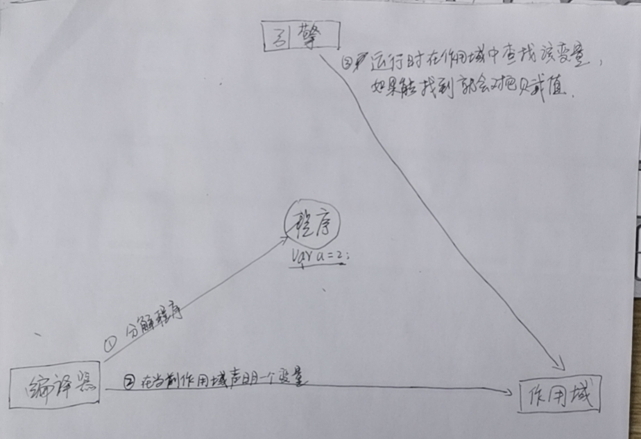

# 1

## 1.2

### 1.2.2

#### 引擎

> 从头到尾负责整个JavaScript程序的编译及执行过程

#### 编译器  

> 引擎的好朋友之一，负责语法分析及代码生成等  

#### 作用域  

> 引擎的另一位好友，负责收集并维护由所有声明的标识符（变量）组成的一系列查询，并实施一套非常严格的规则，确定当前执行的代码对这些标识符的访问权限  

#### 下面我们将var a = 2；分解，看看引擎和它的朋友们是如何工作的。<kbd>①</kbd>编译器首先会将这段程序分解成词法单元，然后将词法单元解析成一个树结构。但是当编译器开始进行代码的生成时，它对这段程序的处理方式会和预期的有所不同。可以合理地假设编译器所产生的的代码能够用下面的伪代码进行概括：“为了一个变量分配内存，将其命名为a，然后将值2保存进变量。“然而，这并不完全正确。  

* 事实上编译器会进行如下处理。  

> 遇到`var a`，编译器会询问作用域是否已经有一个该名称的变量存在于同一个作用域的集合中。如果是，编译器会忽略该说明，继续进行编译；否则它会要求作用域在当前作用域的集合中声明一个新的变量，并命名为`a`。  
> <kbd>②</kbd>接下来编译器会为引擎生成运行时所需的代码，这些代码被用来处理`a = 2`这个赋值操作。<kbd>③</kbd>引擎运行时会首先询问作用域，在当前的作用域集合中是否存在一个叫做a的变量。如果是，引擎就会使用这个变量；如果否，引擎会继续查找该变量（查看1.3节）。  

* 如果引擎最终找到了a变量，就会将2赋值给它。否则引擎就会举手示意并抛出一个异常！
* 总结：变量的赋值操作会执行两个动作，首先编译器会在当前作用域中声明一个变量（如果之前没有声明过），然后在然后在运行时引擎会在作用域中查找该变量，如果能够找到会对它赋值。  

<!--  -->


### 1.2.3编译器有话说  

* 编译器在编译过程的第二步中生成了代码，引擎执行它时，会通过查找变量a来判断它是否已声明过。超找的过程由作用域进行协助，但是引擎执行怎么的查找，会影响最终的查找结果。  
* 在我们的例子中，引擎会为变量a进行`LHS`查询。另一个查找的类型叫做 `RHS`。  
* `L`和`R`分别代表赋值操作左侧和右侧。换句话说，当变量出现在赋值操作的左侧时进行`LHS`查询，出现在右侧时进行`RHS`查询。  
* 讲的准确一点，`RHS`查询与简单地查找某个变量的值别无二致，而`LHS`查询则是试图找到变量的容器本身，从而可以对其赋值。从这个角度说，`RHS`并不是真正意义上的“赋值操作的右侧”，更准确地说是“非左侧”。  
* 你可以将`RHS`理解成retrieve his source value（取到它的源值），这意味着“得到某某值”。

```JavaScript
LHS和RHS的含义是“赋值操作的左侧或右侧”并不一定意味着就是“=赋值操作符的左侧或右侧”。赋值操作还有其它几种形式，因此在概念上最好将其理解为“赋值操作的目标是谁（LHS）”以及“谁是赋值操作的源头（RHS）”。
```  

### 5.5.1 现代的模块机制

* 大多数模块依赖加载器/管理器本质上都是将这种模块定义封装进一个友好的API。简单地介绍一些核心概念：

```JavaScript
    var MyModules = (function Manager() {
        var modules = {};
        function define(name, deps, impl) {
            for (var i=0; i<deps.length; i++){
                deps[i] = modules[deps[i]];
            }
            modules[name] = impl.apply(impl, deps);
        }

        function get(name){
            return modules[name];
        }

        return {
            define: define,
            get: get
        }
    })();
```

* 这段代码的核心是`modues[name] = impl.apply(impl, deps)`。为了模块的定义引入了包装函数（可以传入任何依赖），并且将返回值，也就是模块的API，存储在一个根据名字来管理的模块列表中。

* 下面展示了如何使用它来定义模块：

```JavaScript
    MyModules.define('bar', [], function(){
        function hello(who){
            return 'Let me introduce: ' + who;
        }

        return {
            hello: hello
        };
    });

    MyModules.define('foo', ['bar'], function(bar){
        var hungry = 'hippo';

        function awesome(){
            console.log(bar.hello(hungry).toUpperCase());
        }

        return {
            awesome: awesome
        };
    });

    var bar = MyModules.get('bar');
    var foo = MyModules.get('foo');

    console.log(
        bar.hello('hippo')
    ); // Let me introduce: hippo
    foo.awesome(); // LET ME  INTRODUCE: HIPPO
```

* "foo"和"bar"模块都是通过一个公共API的函数来定义的。"foo"甚至接受"bar"的实例作为依赖参数，并能相应地使用它。

* 为我们自己着想，应该多花点时间来研究这些示例代码并完全理解闭包的作用吧。最重要的是要理解模块管理器没有任何特殊的“魔力”。它们符合前面列出的模块模式的两个特点：调用包装了函数定义的包装函数，并且返回值作为该模块的API。

### 5.6 小结

* 闭包就好像从JavaScript中分离出来的一个充满神秘色彩的未开化世界，只有最勇敢的人才能走到那里。但实际上它只是一个普通且明显的事实，那就是我们在此词法作用域的环境下写代码，而其中的函数也是值，可以随意传来传去。

* 当函数可以记住并访问所在的词法作用域，即使函数是在当前词法作用域之外执行，这时就产生了闭包。

* 如果没能认出闭包，也不了解它的工作原理，在使用它的过程中就很容易犯错，比如在循环中。但同时闭包也是一个非常强大的工具，可以用多种形式来实现模块等模式。

* 模块有两个主要特征：

> (1) 为创建内部作用域而调用了一个包装函数；  
> (2) 包装函数的返回值必须至少包括一个对内部函数的引用，这样就会创建涵盖整个包装函数内部作用域的闭包。

### 第二部分 this和对象原型

> * 本书第二部分`this和对象原型`，很好的衔接了本书第一部分”作用域和闭包“，进一步介绍了JavaScript语言中非常重要的两个部分，this关键字和原型。这两个部分对于你未来的学习来说非常重要，它们是使用JavaScript进行编程的基础。只有掌握了如何创建、关联和扩展对象，你才能用JavaScript创建类似谷歌地图这样大型的复杂应用。  
> * 需要明确的是，`this在任何情况下都不指向函数的词法作用域`。在JavaScript内部，作用域确实和对象类似，可见的标识符都是它的属性。但是作用域”对象“无法通过JavaScript代码访问，它存在于JavaScript引擎内部。

### 1.3 this到底是什么

> * 之前我们说过`this`是在运行时进行绑定的，并不是在编写时绑定，它的上下文取决于函数调用时的各种条件。this的绑定和函数声明的位置没有任何关系，只取决于函数的调用方式。  
> * 当一个函数被调用时，会创建一个活动记录（有时候也称为执行上下文）。这个记录会包含函数在哪里被调用（调用栈）、函数的调用方式、传入的参数等信息。`this`就是这个记录的一个属性，会在函数执行的过程中用到。  
> * 学习`this`的第一步是明白this既不指向函数自身也不指向函数的词法作用域，抛开以前错误的假设和理解。this实际上是在函数被调用时发生的绑定，它指向什么完全取决于函数在哪里调用。  

### 2.1 调用位置

* 在理解this的绑定过程之前，首先要理解调用位置：调用位置就是函数在代码中被调用的位置（而不是声明的位置）。只有仔细分析调用位置才能回答这个问题：这个this到底引用的是什么？

* 通常来说，寻找调用位置就是寻找“函数被调用的位置”，但是做起来并没有这么简单，因为某些编程模式可能会隐藏真正的调用位置。

* 最重要的是要分析调用栈（就是为了到达当前执行位置所调用的所有函数）。我们关心的调用位置就在当前正在执行的函数的前一个调用中。

> 下面我们来看看到底什么是`调用栈`和`调用位置`：

```JavaScript
    function baz(){
        // 当前调用栈是：baz
        // 因此，当前调用位置是全局作用域
        console.log('baz');
        bar(); // <-- bar的调用位置
    }

    function bar(){
        // 当前调用栈是baz -> bar
        // 因此，当前调用位置在baz中
        console.log('bar');
        foo(); // <-- foo的调用位置
    }

    function foo(){
        // 当前调用栈是baz -> bar ->foo
        // 因此，当前调用位置在bar中
        console.log('foo');
    }

    baz(); // <-- baz的调用位置
```

* 注意我们是如何（从调用栈中）分析出真正的调用位置的，因此它决定了this的绑定。

```JavaScript
你可以把调用栈想象成一个函数调用链，就像我们在前面的代码段的注释中所写的一样。就本例来说你可以在工具中给 foo()函数的第一行代码设置一个断点，或者直接在第一行代码之前插入一条debugger;语句。运行代码时，调试器会在那个位置暂停，同时会展示当前位置的函数调用列表，这就是你的调用栈。因此，如果你想要分析this的绑定，使用开发者工具得到调用栈，然后找到栈中第二个元素，这就是真正的调用位置。
```
